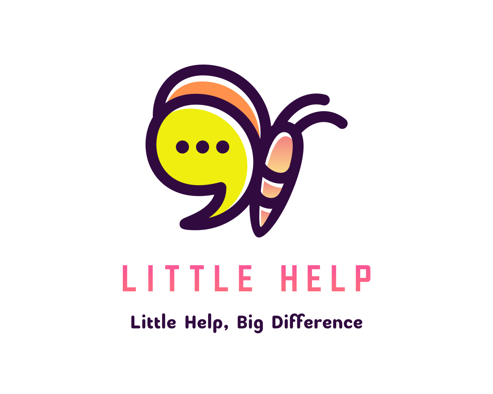

# Hello! :wave: Welcome!

  

## 🧚🏻 About us
**Little Help** is an AI-powered chat scheduler that helps small business owners enhance their customer service and manage their appointments more efficiently. We help you follow up with your customers, handle reservations and cancellations, rescheduling, send out reminders through intuitive chat messages.

## 🔖 Features
**Little Help** integrates with your WeChat, Whatsapp, iMessages and connects with Google Calendar, iCalendar, etc.

### Automated Chatting
Engages with your customers directly via chat to handle appointment details, questions, and more.

### Proactive Follow-ups
Automatically response or send chat messages to remind clients about upcoming appointments or follow up on pending actions.

### Cancellation and Rescheduling Management
Facilitates easy cancellations or changes to appointments through chat, keeping all parties informed and schedules updated.

### Customizable Interactions
Tailor chat messages to fit your business tone and customer engagement style.

## :coffee: Get in touch
For more information about **Little Help** or to schedule a demo, DM 💬💬 us!
We're excited to see how **Little Help** can make a big difference in your business!
